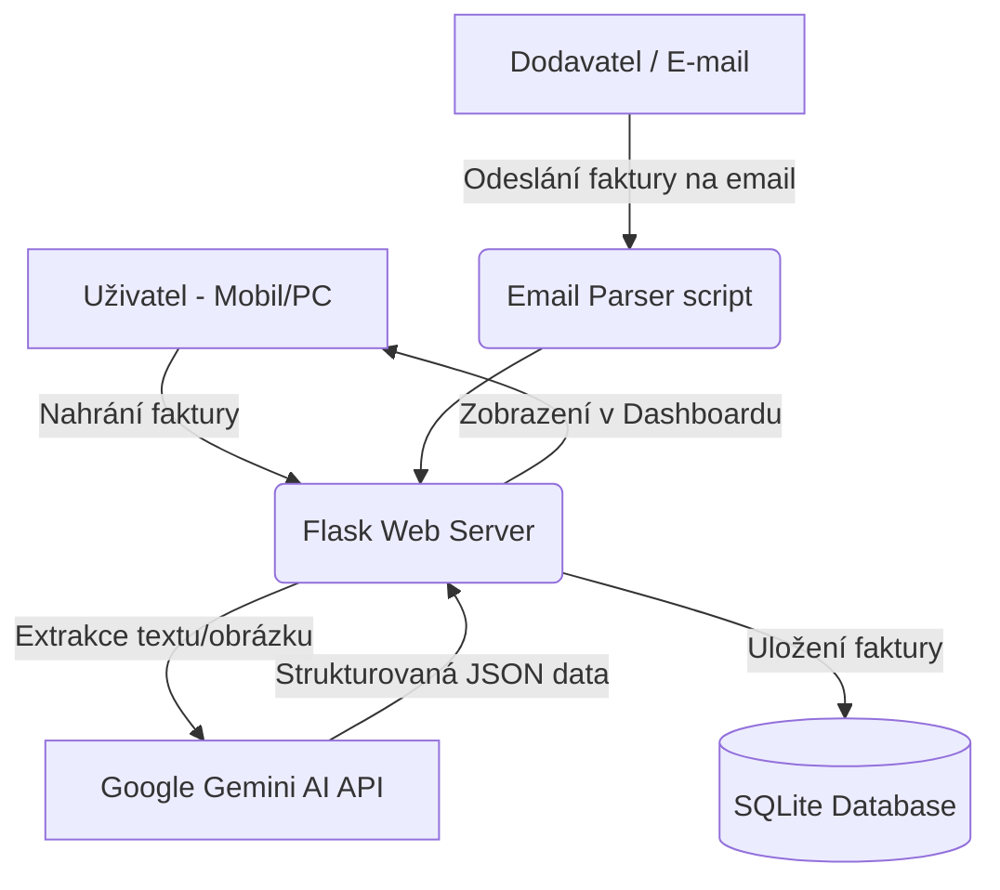

# 🤖 FakturaBox

> **Automatické zpracování a evidence faktur pro řemeslníky a živnostníky s využitím AI.**
> 
> 🌐 **Projekt běží živě na:** [fakturabox.cz](https://fakturabox.cz)

Projekt vznikl jako reálná pomoc pro mého tátu (instalatéra), kterému přepisování faktur do Excelu zabíralo hodiny času. Dnes systém běží v produkci na vlastním serveru a pomáhá automatizovat papírování.

---

## 🚀 Hlavní funkce

- **Chytré čtení faktur (OCR + AI):** Nahrajete PDF nebo fotku faktury z mobilu. Systém pomocí **Google Gemini AI** automaticky rozpozná dodavatele, částky, IČO, bankovní účty, data splatnosti a rozpis DPH.
- **Automatické zpracování z E-mailu:** Každý uživatel získá unikátní e-mailovou schránku (např. `firma@fakturabox.cz`). Faktury, které mu tam dorazí od dodavatelů, systém automaticky stáhne, zpracuje a zaeviduje.
- **Přehledný dashboard:** Statistiky nákladů, grafy, filtrace a exporty pro účetní.
- **Responzivní design:** Optimalizováno pro mobily – řemeslník může fakturu vyfotit přímo na stavbě.

---

## 🛠️ Použité technologie

### Backend
- **Python & Flask:** Výkonné a lehké webové rozhraní.
- **SQLite:** Rychlá lokální databáze pro bezpečné ukládání dat uživatelů a faktur.
- **IMAP / Email processing:** Skripty na pozadí pro automatické stahování příloh z e-mailových schránek.

### AI & Zpracování dokumentů
- **Google Gemini API (Gemini 1.5 Flash / Flash-Lite):** Slouží jako inteligentní engine pro parsování textu z PDF a analýzu obrázků (multimodální OCR). 
- **PyPDF2 / PDF extraction:** Extrakce textových vrstev z digitálních dokumentů.

### Frontend
- **HTML5 & Vanilla CSS3:** Čistý, moderní a extrémně rychlý frontend bez těžkých frameworků. CSS stylováno s důrazem na tmavý režim (dark mode) a intuitivní UX pro starší uživatele.
- **JavaScript (ES6):** Dynamické načítání dat, drag-and-drop nahrávání souborů a interaktivní grafy.

### DevOps & Hosting
- **VPS Hetzner (Ubuntu Server):** Produkční nasazení celého systému.
- **Nginx:** Reverzní proxy server pro směrování požadavků a obsluhu statických souborů.
- **Systemd:** Správa procesů na pozadí (web server, e-mailový parser).
- **SSL (Certbot / Let's Encrypt):** Plné zabezpečení HTTPS protokolu.

---

## 📊 Architektura systému

---

## 📈 Reálné výsledky & Marketing

Projekt byl úspěšně otestován v reálném provozu. Pro propagaci byla vytvořena TikTok kampaň s osobním příběhem, která zaznamenala:
- **4 500+ zhlédnutí** videa během 24 hodin.
- **600+ unikátních uživatelů** (prokliků) na landing page z mobilních zařízení.
- Potvrzení zájmu cílové skupiny (řemeslníci a živnostníci) o jednoduché řešení bez nutnosti složitého nastavování.

---

